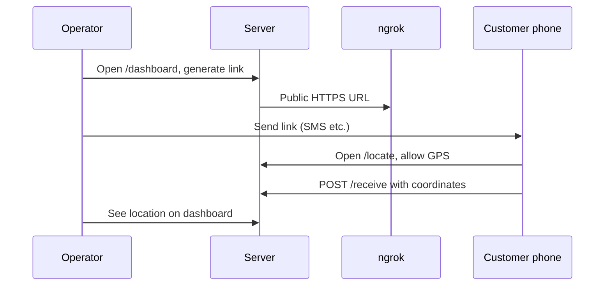

# Location Consent Service

Generate **HTTPS** location-sharing links for customers, collect GPS with explicit consent, and view results on an operator dashboard.

- **Local:** `./run.sh` starts the server + Cloudflare tunnel (HTTPS on your phone).
- **Internet:** Deploy to **Vercel** (recommended), **Render**, **Railway**, or Docker — locations stored in **Vercel KV** (cache) or in-memory on a single server.

## Quick start

```bash
# 1. Copy env and add your ngrok token (required once)
cp .env.example .env
# Edit .env → set NGROK_AUTHTOKEN=...

# 2. Authenticate ngrok (once)
ngrok config add-authtoken YOUR_TOKEN

# 3. Run everything
chmod +x run.sh
./run.sh
```

Open **http://127.0.0.1:8000/dashboard** — generate a link, copy it, send to your customer (SMS/WhatsApp).

## How it works



| URL | Purpose |
|-----|---------|
| `/dashboard` | Operator UI — create links, view locations |
| `/link?service=...&ref=...` | API to generate customer link |
| `/locate?...` | Customer consent page |
| `/receive` | Receives GPS JSON from the page |
| `/location/{ref}` | Lookup one job by reference |
| `/locations` | List all captured locations |

Locally, data is saved to `locations.json`. When deployed, data is kept in **memory** (resets if the container restarts).

## Deploy on Vercel

Vercel runs the app as serverless functions. You need **shared storage** so the dashboard and customer submissions see the same data.

> **Note:** Vercel removed built-in “KV”. Your storage options are **Blob**, **Edge Config**, or **Marketplace** providers.

| Option | Use for locations? |
|--------|-------------------|
| **Blob** | **Yes — recommended.** Stores `locations.json` in object storage. |
| **Marketplace → Upstash Redis** | **Yes.** Redis cache (same as old KV). |
| **Edge Config** | **No.** Meant for feature flags; writes are slow. |

### 1. Create Blob storage (recommended)

1. [Vercel dashboard](https://vercel.com) → your project → **Storage** → **Browse Storage**
2. Choose **Blob** → **Create** → connect to your project  
3. Vercel injects `BLOB_READ_WRITE_TOKEN` automatically

**Alternative:** scroll to **Marketplace Database Providers** → add **Upstash Redis** → that sets `KV_REST_API_URL` / `KV_REST_API_TOKEN`.

### 2. Deploy

```bash
npx vercel
npx vercel --prod
```

Redeploy after any code change. The Vercel entrypoint is root `app.py` (not Mangum). If you see `FUNCTION_INVOCATION_FAILED`, check **Deployments → Functions → Logs**.

### 3. Use it

- Operator dashboard: `https://YOUR-PROJECT.vercel.app/dashboard`
- Generate a customer link from the dashboard (HTTPS — required for GPS on phones)
- Locations appear on the dashboard after customers share

`vercel.json` sets `USE_TUNNEL=0` and `LOCATION_STORAGE=auto` (Blob if connected, else Upstash). Your production URL is detected from `VERCEL_PROJECT_PRODUCTION_URL`.

### Local test (optional)

```bash
pip install -r requirements.txt
vercel dev
```

## Deploy on the internet (Docker / other hosts)

### Docker (any cloud)

```bash
docker build -t location-consent .
docker run -p 8000:8000 -e PUBLIC_BASE_URL=https://your-domain.com location-consent
```

Set `PUBLIC_BASE_URL` to your public HTTPS URL so generated customer links use the right host.

### VESSL AI

1. Build and push the image from this repo (`Dockerfile` is included).
2. Edit `vessl-service.yaml` — set `image:` to your registry image and `resources.cluster` to your cluster.
3. Deploy: `vessl service create -f vessl-service.yaml`
4. Open the HTTPS endpoint from the VESSL console → `/dashboard`

### Render

Connect the repo on [Render](https://render.com); `render.yaml` is included. Render sets `RENDER_EXTERNAL_URL` automatically.

### Environment (deployed)

| Variable | Value |
|----------|--------|
| `USE_TUNNEL` | `0` |
| `LOCATION_STORAGE` | `auto` (Vercel), `memory` (Docker) |
| `PUBLIC_BASE_URL` | Your HTTPS URL (optional if the platform sets a known env var) |

On Vercel, connect **Blob** (`BLOB_READ_WRITE_TOKEN`) or **Upstash Redis** from the Marketplace.

## API examples

```bash
# Generate link (uses ngrok URL when tunnel is active)
curl "http://127.0.0.1:8000/link?service=My+Company&ref=JOB-001"

# Check tunnel
curl http://127.0.0.1:8000/api/tunnel

# List locations
curl http://127.0.0.1:8000/locations
```

## Requirements

- Python 3.12+
- [ngrok](https://ngrok.com/download) with authtoken configured
- Linux: use a venv (`./run.sh` creates one automatically)

## Troubleshooting

| Problem | Fix |
|---------|-----|
| `externally-managed-environment` | Use `./run.sh` — never `pip install` system-wide |
| `ModuleNotFoundError: uvicorn` | Run `.venv/bin/python location_server.py` or `./run.sh` |
| No public URL / tunnel badge yellow | Set `NGROK_AUTHTOKEN` in `.env`, run `ngrok config add-authtoken …` |
| Customer GPS blocked | Link must be **HTTPS** (ngrok provides this) |
| Locations not saved on Vercel | Connect **Blob** or **Upstash Redis** in Vercel Storage; memory cannot persist serverless submissions |
| Port 8000 in use | `fuser -k 8000/tcp` then `./run.sh` again |

## Manual run (no run.sh)

```bash
python3 -m venv .venv
.venv/bin/pip install -r requirements.txt
ngrok http 8000 &
.venv/bin/python location_server.py
```
