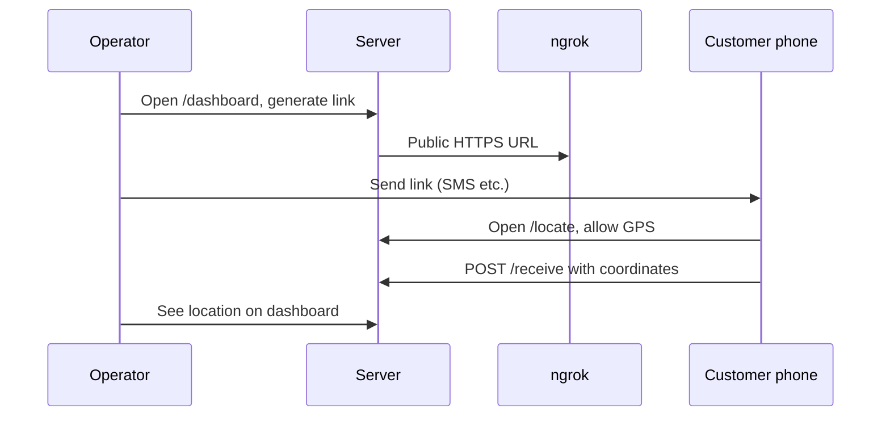

# Location Consent Service

Generate **HTTPS** location-sharing links for customers, collect GPS with explicit consent, and view results on an operator dashboard. Uses **ngrok** so links work on real phones (not just localhost).

## Quick start

```bash
# 1. Copy env and add your ngrok token (required once)
cp .env.example .env
# Edit .env → set NGROK_AUTHTOKEN=...

# 2. Authenticate ngrok (once)
ngrok config add-authtoken YOUR_TOKEN

# 3. Run everything
chmod +x run.sh
./run.sh
```

Open **http://127.0.0.1:8000/dashboard** — generate a link, copy it, send to your customer (SMS/WhatsApp).

## How it works



| URL | Purpose |
|-----|---------|
| `/dashboard` | Operator UI — create links, view locations |
| `/link?service=...&ref=...` | API to generate customer link |
| `/locate?...` | Customer consent page |
| `/receive` | Receives GPS JSON from the page |
| `/location/{ref}` | Lookup one job by reference |
| `/locations` | List all captured locations |

Data is saved to `locations.json` automatically.

## API examples

```bash
# Generate link (uses ngrok URL when tunnel is active)
curl "http://127.0.0.1:8000/link?service=My+Company&ref=JOB-001"

# Check tunnel
curl http://127.0.0.1:8000/api/tunnel

# List locations
curl http://127.0.0.1:8000/locations
```

## Requirements

- Python 3.12+
- [ngrok](https://ngrok.com/download) with authtoken configured
- Linux: use a venv (`./run.sh` creates one automatically)

## Troubleshooting

| Problem | Fix |
|---------|-----|
| `externally-managed-environment` | Use `./run.sh` — never `pip install` system-wide |
| `ModuleNotFoundError: uvicorn` | Run `.venv/bin/python location_server.py` or `./run.sh` |
| No public URL / tunnel badge yellow | Set `NGROK_AUTHTOKEN` in `.env`, run `ngrok config add-authtoken …` |
| Customer GPS blocked | Link must be **HTTPS** (ngrok provides this) |
| Port 8000 in use | `fuser -k 8000/tcp` then `./run.sh` again |

## Manual run (no run.sh)

```bash
python3 -m venv .venv
.venv/bin/pip install -r requirements.txt
ngrok http 8000 &
.venv/bin/python location_server.py
```
